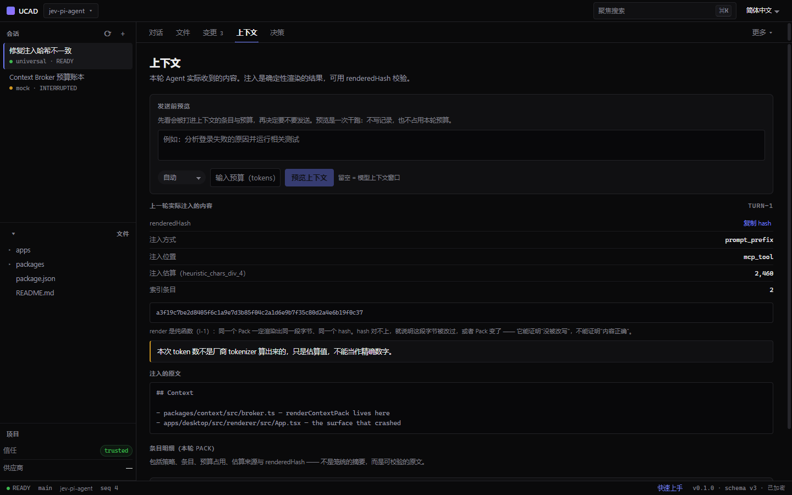
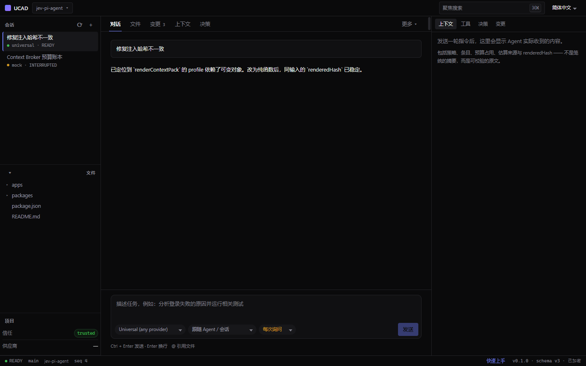
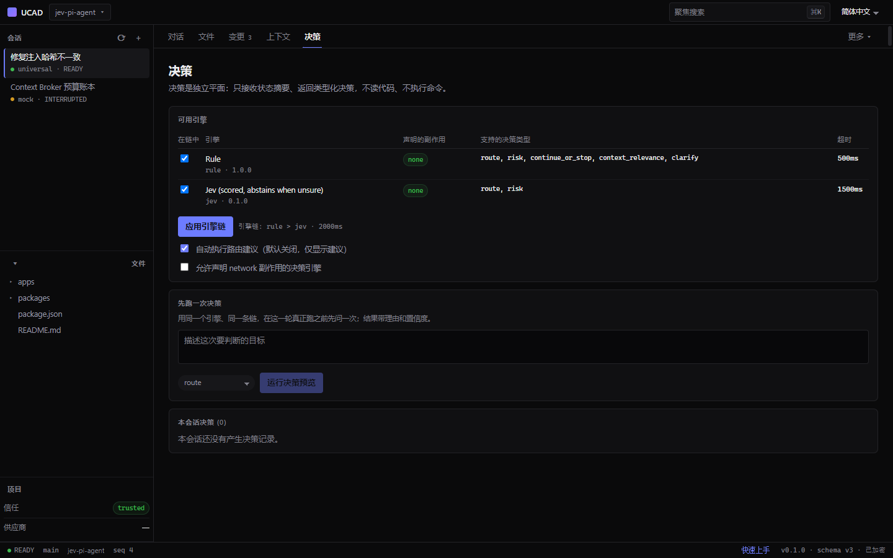
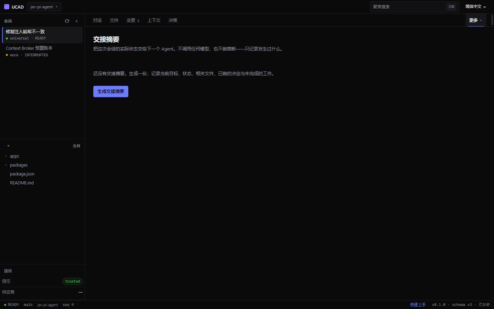

# UCAD

**Run several coding agents on one workspace — and be able to prove what each of them actually received.**

[English](#english) · [中文](#中文)



---

## English

When you run more than one coding agent, two questions stay open:

- **What context did the agent actually get?** The prompt you wrote, the files
  that were summarised, the rules that were prepended — after three hops through
  a broker, a budget ledger and a token estimator, the answer is usually "roughly
  that".
- **Why did it take that route?** Which engine decided, on what signal, with how
  much confidence, and did anything fall back?

UCAD is a control plane for that. It does not try to be an editor, a terminal
agent, or a model provider. It makes the two answers checkable.

### What it does

- **Verifiable injection.** The context pack is produced by a pure function and
  carries a content hash. You can read the rendered text and compare the hash —
  change one byte and it stops matching.
- **Explainable routing.** Every decision records its rationale, its confidence
  and the engine that produced it. A fallback is recorded as a fallback.
- **Honest estimates.** Token counts say whether they came from the vendor's
  tokenizer or from a heuristic, and say so on screen.
- **A permission gate that cannot be bypassed.** An agent asking to run
  something gets a decision recorded, with the reason, before it happens.
- **Handoffs between agents.** A readable record of what was decided, changed,
  run and left open — the next agent reads it instead of re-asking you.
- **Any OpenAI-compatible provider.** One protocol, many vendors; credentials
  are stored one-way in the OS keychain and never leave the main process.
- **MCP servers.** Configure a server, see its health honestly, remove it.
- **Bilingual.** The interface is Chinese and English, switchable at runtime.

### Screenshots

| | |
|---|---|
|  |  |
| The conversation surface, with the session list and workspace tree. | The decision plane: engines, what they may decide, and the audit trail. |
|  | |
| A handoff record: what was decided, changed, run, and left open. | |

### Quick start

Requires Node.js 22.12 or newer (the Electron 44 packaging toolchain and the
test suite both declare it as their floor).

```bash
git clone https://github.com/castorhrio/jev-pi-agent.git
cd jev-pi-agent
npm install
npm run dev
```

`npm run dev` builds everything and launches the desktop app. No API key is
needed until you actually call a model.

To work on the interface without Electron or credentials:

```bash
npm run dev:web
```

This serves the renderer in a browser against an in-memory fixture.
Append `?scenario=empty`, `?scenario=loading`, `?scenario=error`,
`?scenario=partial` or `?scenario=permission` to see the other states.

### Building an installer

```bash
npm run dist     # Windows NSIS installer
npm run package  # unpacked build, no installer
```

**On Windows the installer step needs symlink privilege.** `electron-builder`
extracts a cache archive that contains symbolic links, so Developer Mode must be
on, or the command must run elevated. The unpacked build is unaffected.

### Current limitations

Stated plainly, because a tool that hides its edges is harder to trust than one
that does not.

- **One provider protocol ships.** The bundled adapter speaks the
  OpenAI-compatible protocol. Native vendor adapters are not implemented.
- **The installer is unsigned.** Windows SmartScreen warns on first run.
- **Auto-update is inert until a feed is configured.** Set `UCAD_UPDATE_FEED` to
  an `https://` URL and the app will check it. With no feed it says so rather
  than failing quietly.
- **The interactive terminal needs `node-pty`.** It is an optional dependency;
  without it the terminal panel reports that it is unavailable instead of
  pretending to work. The command channel still runs.

### Contributing

See [CONTRIBUTING.md](CONTRIBUTING.md) — how to run the gates, what the
repository expects of a change, and how to add a workspace package.

### License

[MIT](LICENSE)

---

## 中文

同时跑多个编码 Agent 时，有两个问题始终没有答案：

- **Agent 到底拿到了什么上下文？** 你写的提示词、被摘要的文件、被前置的规则——
  经过 broker、预算账本、token 估算器三层之后，答案通常只是"大概那些"。
- **它为什么走了这条路由？** 哪个引擎、依据什么信号、置信度多少、有没有发生回落？

UCAD 就是为这两个问题做的控制面。它不试图当编辑器、当终端 Agent、当模型厂商，
它让这两个答案**可核对**。

### 它能做什么

- **注入可验证。** Context Pack 由纯函数产出并带内容哈希，
  你可以读渲染后的原文、比对哈希——改动一个字节就对不上了。
- **决策可解释。** 每次决策都记录 `rationale`、`confidence` 和产出它的引擎；
  回落会**作为回落被记录**。
- **估算说实话。** token 数会标明来自厂商 tokenizer 还是启发式估算，并在界面上写明。
- **绕不过的权限门。** Agent 要执行操作前，先得到一个被记录的决定和它的理由。
- **Agent 之间的交接。** 一份可读的记录：决定了什么、改了什么、跑过什么、还剩什么——
  下一个 Agent 读它，而不是再问你一遍。
- **任意 OpenAI 兼容厂商。** 一个协议覆盖多家；凭据单向存进系统钥匙串，
  永不离开主进程。
- **MCP 服务器。** 添加、看健康状态、移除。
- **中英双语。** 界面中英可切换。

### 截图

| | |
|---|---|
|  |  |
| 对话界面，左侧会话列表与工作区文件树。 | 决策平面：可用引擎、各自的决策类型、审计记录。 |
|  | |
| 交接记录：决定了什么、改了什么、跑过什么、还剩什么。 | |

### 快速开始

需要 Node.js 22.12 或更高版本（Electron 44 打包工具链与测试套件都以它为下限）。

```bash
git clone https://github.com/castorhrio/jev-pi-agent.git
cd jev-pi-agent
npm install
npm run dev
```

`npm run dev` 会构建全部产物并启动桌面应用。**不配任何 API key 也能跑起来**，
直到你真的去调用模型。

只做界面开发、不需要 Electron 和凭据：

```bash
npm run dev:web
```

在浏览器里跑渲染层，数据来自内存 fixture。
追加 `?scenario=empty`、`?scenario=loading`、`?scenario=error`、
`?scenario=partial` 或 `?scenario=permission` 可以看其他状态。

### 构建安装包

```bash
npm run dist     # Windows NSIS 安装包
npm run package  # 免安装目录，不出安装包
```

**Windows 上出安装包需要符号链接权限。** `electron-builder` 要解包一个内含符号链接的
缓存包，因此需要开启开发者模式或以管理员身份运行；免安装目录不受影响。

### 当前局限

直说，因为**藏边界的工具比不藏的更不值得信任**。

- **只随包发布一种厂商协议。** 内置适配器走 OpenAI 兼容协议，厂商原生适配器未实现。
- **安装包未签名。** Windows 首次运行会有 SmartScreen 提示。
- **自动更新在配置更新源之前是空的。** 把 `UCAD_UPDATE_FEED` 指向一个 `https://`
  地址即可启用；没有配置时应用会直说，而不是静默失败。
- **交互式终端依赖 `node-pty`。** 它是可选依赖；缺失时终端面板会如实说不可用，
  而不是假装能跑。命令通道仍然可用。

### 参与贡献

见 [CONTRIBUTING.md](CONTRIBUTING.md) —— 怎么跑门禁、这个仓库对一次改动有什么要求、
以及怎么新增一个 workspace 包。

### 许可

[MIT](LICENSE)
